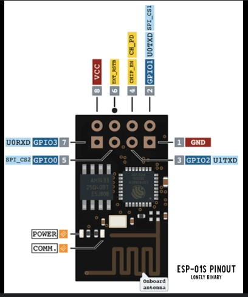

# esp8266-01-ServoTests
## Controlling Servo Motor with esp8266 01 over WiFi with Smartphone
# Connection
- Servo --> esp8266 01
- VCC (Red)   --------> 3.3V
- GND (Brown) --------> GND
- ServoPin (Orange) --> GPIO 2 (Pin 2)

## esp8266-01 Pins

# Setup
- 1 Open Arduino IDE
- 2 Sellect Generic esp8266 Board
- 3 Sellect correct pin of your esp8266 01
- 4 Copy & paste the code to Arduino IDE
- 5 Upload the code
- 6 on Your Phone connect to WiFi Called "ServoControll" and write password "Servo001"
- OR Sellect other code for connect your esp8266 01 to Your OWN WiFi Network
- 6 Open Your Web browser and type this : 192.168.4.1 (and enter)
- 8 Control your servo with mooving finger on pointer
## Thats it & all ... Enjoy :D
